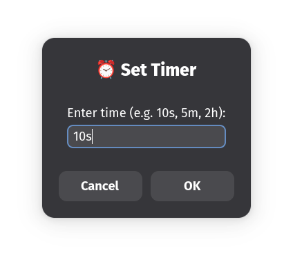

# Zenity Timer (Linux)

- Simple timer for `Linux` environments (irrespective of the Desktop-Environment or Window manager). Utilises `zenity` for the frontend (user input).


>PS: right now it just works, is not **perfect** in any sense, feel free to add to it.


<br>
<br>
<br>

### Installation

- make sure `~/.local/bin` is in path, if not add it in `$PATH` by appending to you `~/.*sh.rc` (shell config)

```bash
# clone it
git clone https://github.com/hail0hydra/zen-timerX.git
cd linux-timer

# create a local desktop entry and local bin entry (skips itself if exists)
mkdir -p ~/.local/share/applications/
mkdir -p ~/.local/bin 

# copy the files required
cp timer ~/.local/bin
cp timer.desktop ~/.local/share/applications

# provide execution access
chmod +x ~/.local/bin/timer


# update the desktop entries
update-desktop-database ~/.local/share/applications/
```


- this should do it. (if you face errors, always remember you are using linux and are smart enough to solve them by yourself)


<br>
<br>

### Usage

- Can be used in __two__ ways:


1. from terminal:

```bash
# just call the timer and mention time in (seconds[s], minutes[m] or hours[h])

timer 10s

# this is call timer in 10 seconds
```

<br>

2. using your app starter (could be `dmenu`/`rofi`/`default mod-key and search`, etc):

```bash
# just search for the app and hit enter, you just need to input time in seconds[s], minuites[m] or hours[h]
```




<br>

GG

